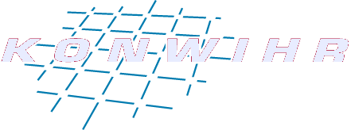

## Acknowledgements

We are grateful for support by BMFTR, KONWIHR, Uniklinikum Erlangen, and FAU Erlangen-Nürnberg.

  
  
  
  

---

## Legal notice

Information pursuant to § 5 DDG (German Digital Services Act):

**Moritz Zaiss**  
Schwabachanlage 6  
91054 Erlangen  
Germany

E-mail: moritz.zaiss@uk-erlangen.de

Responsible for content pursuant to § 18 (2) MStV: Moritz Zaiss, address as above.

---

## Terms of use

By using this tool, you agree to upload sequence and phantom files that are temporarily stored on a server.

You guarantee that you do not upload personal or patient-identifiable data.

## Privacy

Any-Field Scanner runs mostly in your browser. If you use SCAN, your sequence and phantom data are sent to our simulation servers (hosted possibly outside the EU) only to perform the simulation you request. We do not require an account and do not use analytics or advertising cookies. Connection data (e.g. IP address) may be logged for operation and security. Uploads and job data are kept only as long as needed and then deleted. If you upload own phantoms, they go to the same servers and are public, they stay until you delete them. Do not upload personal or patient-identifiable data.